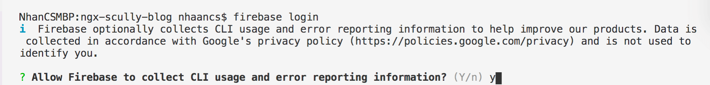
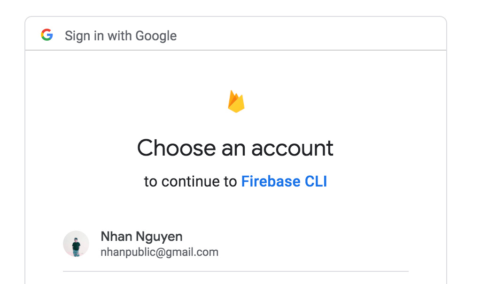
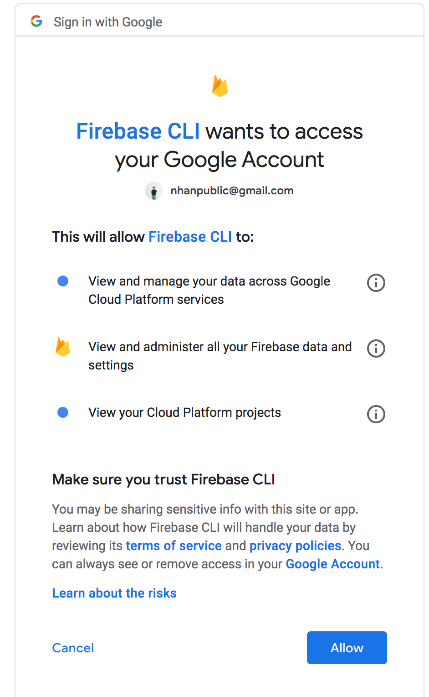
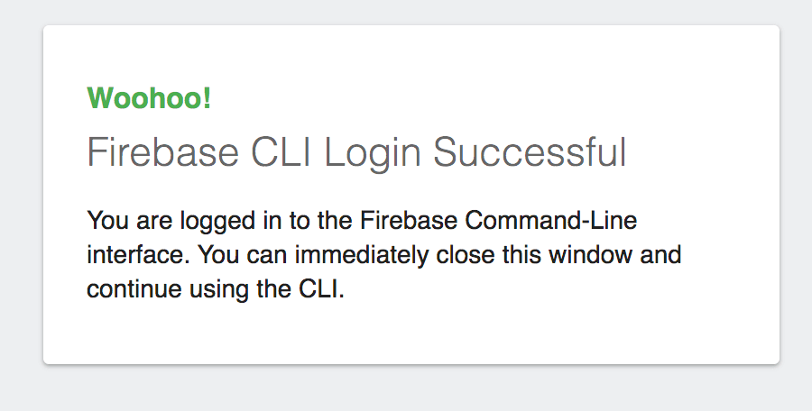
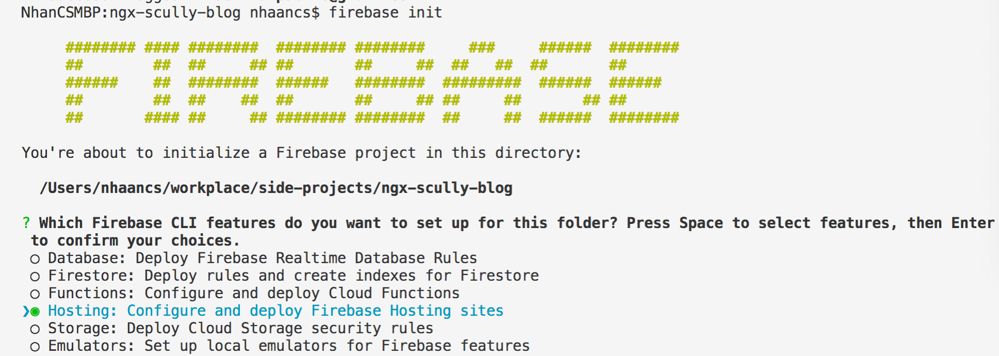
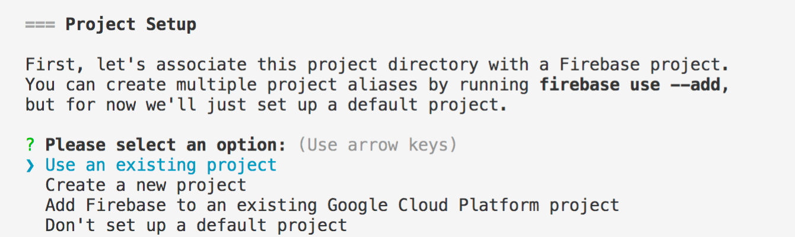
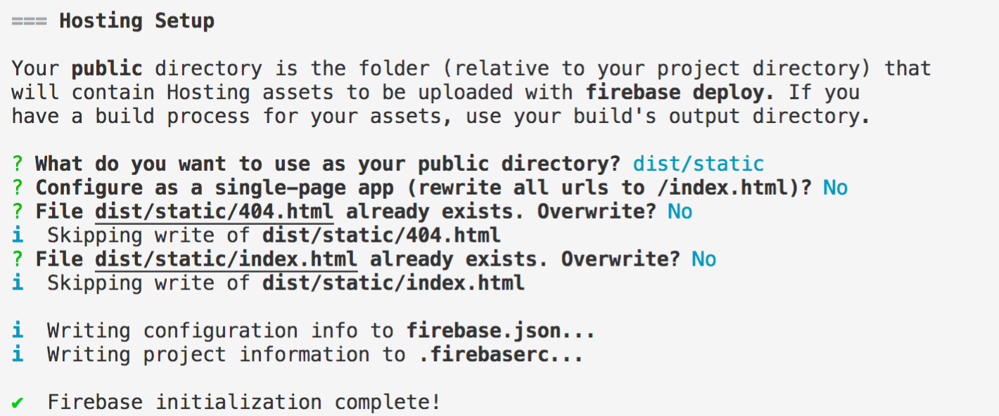
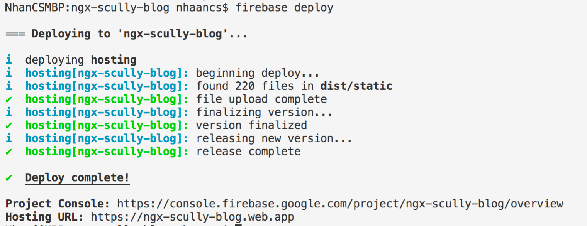
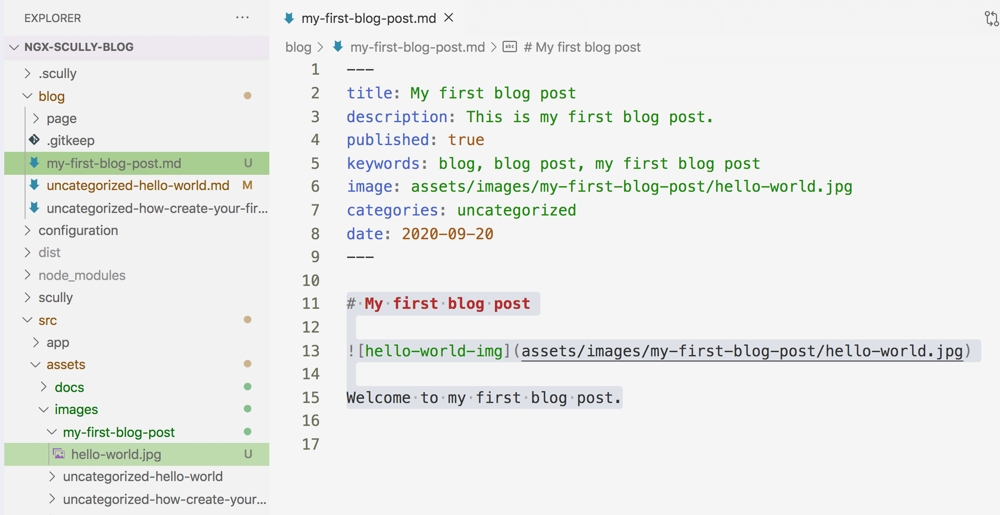

# Ngx-scully-blog: Blog cho lập trình viên (phiên bản 2.0.0)

[English](./README.md) | [Tiếng Việt](./README-Vietnamese.md)

Nếu bạn muốn tạo một blog để chia sẻ kiến thức hay là để phát triển sự nghiệp. Bạn chỉ muốn tập trung vào viết bài và không muốn quan tâm tới những thứ khác như tối ưu hóa công cụ tìm kiếm (SEO), máy chủ, tên miền,... Dự án này có thể giúp bạn.

**Ngx-scully-blog** là một blog đơn giản cho lập trình viên, dễ dàng cài đặt và hỗ trợ SEO. Sau các bước cài đặt ban đầu, bạn chỉ cần tập trung vào viết bài trên các file markdown.

Dự án này được viết bằng Angular, nhưng bạn không cần phải có bất cứ kiến thức gì về Angular. Mình sẽ hướng dẫn bạn từng bước. Nếu bạn là một lập trình viên Angular, điều đó thật tuyệt vời vì với kinh nghiệm của bản thân, bạn có sẽ cảm thấy quen thuộc với dự án hơn.

Blog của mình: [nhannguyendacoder.com](https://nhannguyendacoder.com)

## Table of contents
- [Yêu cầu](#yêu-cầu)
- [Bắt đầu](#bắt-đầu)
    - [Cài đặt Nodejs](#cài-đặt-nodejs)
    - [Cài đặt Angular CLI](#cài-đặt-angular-cli)
    - [Tải source code](#tải-source-code)
    - [Thiết lập Firebase](#thiết-lập-firebase)
    - [Cập nhật thông tin blog](#cập-nhật-thông-tin-blog)
    - [Deploy blog lên Firebase](#deploy-blog-lên-firebase)
- [Viết bài viết đầu tiên](#viết-bài-viết-đầu-tiên)
    - [Tạo file Markdown](#tạo-file-markdown)
    - [Chuẩn bị hình ảnh](#chuẩn-bị-hình-ảnh)
    - [Preview và deploy bài viết](#preview-và-deploy-bài-viết)
- [Một số tip hữu ích](#một-số-tip-hữu-ích)
    - [Quy trình viết và publish bài viết](#quy-trình-viết-và-publish-bài-viết)
    - [Highlight code](#highlight-code)
    - [Nén hình ảnh](#nén-hình-ảnh)
    - [Facebook sharing debugging](#facebook-sharing-debugging)
- [Nâng cao](#nâng-cao)
- [Các câu hỏi khác](#các-câu-hỏi-khác)
- [Các giải pháp thay thế](#các-giải-pháp-thay-thế)
- [Liên kết](#liên-kết)

## Yêu cầu
Các bài viết trên blog của bạn sẽ được viết với định dạng Markdown. Nếu bạn chưa biết về Markdown thì có thể xem qua cú pháp của nó ở [đây](https://guides.github.com/pdfs/markdown-cheatsheet-online.pdf).

## Bắt đầu

### Cài đặt Nodejs
Bạn cần cài đặt Nodejs để chạy dự án này. Bạn có thể tải và cài đặt Nodejs cho hệ điều hành của mình tại [nodejs.org/en/download](https://nodejs.org/en/download).

### Cài đặt Angular CLI
Bạn cần cài đặt Angular CLI để chạy các lệnh của Angular. Chạy lệnh `npm install -g @angular/cli` trong cửa sổ dòng lệnh để cài đặt Angular CLI trên máy của bạn.

*Nếu có lỗi xảy ra, bạn có thể chạy lệnh thay thế là `sudo npm install -g firebase-tools`, lưu ý là sau đó bạn cần phải nhập mật khẩu của máy tính.*

### Tải source code
Mở cửa sổ dòng lệnh và chạy tuần tự các lệnh sau:
- `git clone https://github.com/nhaancs/ngx-scully-blog.git`
- `cd ngx-scully-blog`
- `npm install`
- `npm run scully:preview`

Kết quả khi chạy lệnh cuối cùng:


Trong cửa sổ trình duyệt, đi đến static server của Scully tại địa chỉ [http://localhost:1668](http://localhost:1668). Bạn sẽ thấy như sau:


**Lưu ý**: Bạn sẽ thấy một số nội dung mặc định như "FIRSTNAME LASTNAME", "YOUR JOB TITLE",... Đừng lo lắng vì chúng ta sẽ thay đổi các nội dung này phù hợp với thông tin của bạn ở các bước sau.

Sau đó , click vào icon blog để đi tới trang chủ của blog tại [http://localhost:1668/blog](http://localhost:1668/blog). Nội dung hiển thị như sau:


Chúc mừng, bạn đã thấy được blog của mình trông như thế nào. Bây giờ bạn có thể tắt cửa sổ dòng lệnh và đi đến bước tiếp theo, cài đặt Firebase để host blog của bạn trên internet!

### Thiết lập Firebase
- Đi đến [https://console.firebase.google.com](https://console.firebase.google.com) và login với tài khoản Google của bạn.

- Sau khi login, click vào **Add project** để tạo một project mới.
    

- Nhập tên project và click **Continue**. 
    

    **Note**: nếu tên project của bạn là `ngx-scully-blog` thì địa chỉ blog của bạn sẽ là `ngx-scully-blog.web.app`. Bạn có thể mua một tên miền khác như `yourdomain.com` và thêm vào project của mình sau này. 
- Tắt chức năng **Enable Google analytics for this project** và click **Create project**
    
    
    *Nếu bạn đã có tài khoản Google anlytics, bạn có thể bật tính năng này và click Next để setup tài khoản Google anlytics.*

Ok, chúng ta đã hoàn thành setup cho Firebase. Bây giờ hãy quay trở lại source code để cập nhật thông tin của bạn vào blog và deploy lên Firebase.

### Cập nhật thông tin blog
- Mở thư mục source code bạn đã clone ở bước trước (`ngx-scully-blog`), mình dùng [vscode](https://code.visualstudio.com), bạn cũng có thể sử dụng editor riêng.
- Mở file [`ngx-scully-blog/configuration/site-configs.ts`](./configuration/site-configs.ts). Đây là nơi bạn có thể cập nhật các config và nội dung hiển thị trên blog theo thông tin của cá nhân bạn.
- Bây giờ hãy cập nhật file [`site-configs.ts`](./configuration/site-configs.ts) theo thông tin của bạn. Hãy đọc phần comment trên từng config nếu bạn cần thêm thông tin.
- Thông tin cuối cùng mà bạn cần phải cập nhật là phần config của plugin sitemap, plugin này sẽ tạo ra file `sitemap.xml` cho blog của bạn.
    - Mở file [`ngx-scully-blog/scully.ngx-scully-blog.config.ts`](./scully.ngx-scully-blog.config.ts)
    - Cập nhật giá trị cho key `urlPrefix` thành địa chỉ blog của bạn, có dạng `your-firebase-project-name.web.app`

Tất đã thông tin đã được cập nhật và bạn đã sẵn sàng cho bước tiếp theo, deploy blog của bạn lên Firebase!

### Deploy blog lên Firebase

#### Login Firebase
- Mở terminal trong code editor (trong **vscode**, dùng phím tắt **Ctrl** + **\`** ). Bây giờ bạn đang ở trong thư mục gốc của project, thư mục `ngx-scully-blog`.
- Hãy cài đặt Firebase CLI bằng lệnh sau: `npm install -g firebase-tools`. 

    *Nếu có lỗi xảy ra, bạn có thể chạy lệnh thay thế là `sudo npm install -g firebase-tools`, lưu ý là sau đó bạn cần phải nhập mật khẩu của máy tính.*

- Gõ lệnh `firebase login` để login vào Firebase.
- Nhập `y` để cho phép Firebase thu thập thông tin sử dụng và lỗi, nếu không thì nhập `n`.
    
- Một cửa sổ trình duyệt sẽ được mở ra và bạn có thể chọn tài khoản Firebase để login (hoặc trong một số tình huống có thể bạn phải nhập username và password)
    
- Tiếp theo, click nút "Allow" để cho phép Firebase CLI truy cập vào tài khoản Firebase của bạn.
    

Sau khi đăng nhập thành công như sau:
    

Quay trở lại cửa sổ terminal của code editor, bạn sẽ thấy một tin nhắn thông báo login thành công như bên dưới.
    

#### Init project
- Trong cửa sổ terminal của code editor, gõ lệnh `firebase init` để khởi tạo firebase cho project.
- Firebase CLI sẽ hỏi như sau: **Which Firebase CLI features do you want to set up for this directory? Press Space to select features, then Enter to confirm your choices**:
    - Dùng phím mũi tên xuống để di chuyển con trỏ chuột đến tùy chọn **Hosting: Configure and deploy Firebase Hosting sites**.
    - Ấn nút Space để chọn tùy chọn này.
    
    - Ấn Enter để tiếp tục.
- Ở bước Project setup, Firebase CLI sẽ hỏi bạn một số câu hỏi sau:
    - Please select an option: Chọn tùy chọn **Use an existing project** để sử dụng Firebase project bạn đã tạo ở bước trước và ấn enter. 
     
    - Select a default Firebase project for this directory: Chọn tên Firebase project bạn đã tạo và ấn enter.
- Ở bước Hosting setup, Firebase CLI sẽ hỏi bạn một số câu hỏi sau:
    - What do you want to use as your public directory?: nhập **dist/static** và ấn enter.
    - Configure as a single-page app (rewrite all urls to /index.html)?: nhập **n** và ấn enter.
    - File dist/static/404.html already exists. Overwrite?: Nhập **n** và ấn enter.
     
    - File dist/static/index.html already exists. Overwrite?: Nhập **n** và ấn enter.
    - Kết quả cuối cùng:
     

Ok, bây giờ bạn đã sẵn sàng để deploy blog lên Firebase.

#### Deploy lên Firebase hosting
Trong cửa sổ terminal của code editor, trong thư mục gốc của project, gõ lệnh `npm run scully:deploy`.

Kết quả sẽ như sau:
 

**Note**: blog url của bạn là `your-firebase-project.web.app`. Ví dụ trong trường hợp của mình là `ngx-scully-blog.web.app`.

Chúc mừng, blog của bạn đã online, mọi người đã có thể thấy những gì bạn chia sẻ.

## Viết bài viết đầu tiên
 
### Tạo file Markdown
Các bài viết trên blog của bạn sẽ được viết dưới định dạng Markdown và lưu trong thư mục `ngx-scully-blog/blog`. 

- Đầu tiên, mở thư mục `ngx-scully-blog` trong code editor và tạo file `my-first-blog-post.md` bên trong thư mục `ngx-scully-blog/blog`.
- Mở file `ngx-scully-blog/blog/my-first-blog-post.md`.
- Ở đầu file thêm nội dung bên dưới 
    ```
    ---
    title: My first blog post
    description: This is my first blog post description
    published: true
    keywords: blog, blog post, my first blog post
    image: assets/images/my-first-blog-post/hello-world.jpg
    categories: uncategorized
    date: 2020-09-20
    ---
    ```

    Ý nghĩa:
    - **title** là tiêu đề của bài viết.
    - **description** là phần mô tả ngắn của bài viết.
    - **published** có thể là true hoặc false, xác định xem bài viết của bạn có được publish hay không.
    - **keywords** là các cụm từ xác định nội dung của bài viết, ngăn cách bởi dấu phẩy. Ví dụ: "angular, frontend programming, javascript programming"
    - **image** là hình ảnh sẽ được hiển thị trong phần preview khi bạn chia sẻ bài viết trên mạng xã hội. 
    - **categories** là các danh mục mà bài viết thuộc về, ngăn cách bởi dấu phẩy. Mỗi danh mục là một `category key` của từng danh mục được khai báo trong [`ngx-scully-blog/configuration/advanced/categories.ts`](./configuration/advanced/categories.ts). Uncategorized là danh mục được tạo sẵn.
    - **date** là ngày tháng publish của bài viết, định dạng YYYY-MM-DD, ví dụ, 2020-09-20.
- Tiếp theo là nội dung của bài viết. Thêm nội dung sau vào file Markdown:
    ```
    # My first blog post

    

    Welcome to my first blog post.
    ```

### Chuẩn bị hình ảnh
Mình đã tạo sẵn thư mục `ngx-scully-blog/src/assets/images/my-first-blog-post` và thêm hình `hello-world.jpg` để thêm vào bài viết này. Trong các bài viết tương lai, bạn cần tự chuẩn bị hình cho bài viết của mình.

**Lưu ý**: 
- Tất cả hình ảnh trong blog của bạn đặt trong thư mục `ngx-scully-blog/src/assets/images`. 
- Bạn nên gom các ảnh liên quan tới một bài viết vào một thư mục giống với tên file Markdown của bài viết đó. Ví dụ, `ngx-scully-blog/src/assets/images/my-first-blog-post`. 
- Ví dụ của việc sử dụng hình ảnh trong file Markdown:
    - Phần image header của bài viết: `image: assets/images/my-first-blog-post/hello-world.jpg`
    - Hình ảnh trong nội dung bài viết: ``.

Kết quả cuối cùng bao gồm file Markdown và hình ảnh:
 

### Preview và deploy bài viết
Khi bài viết đã hoàn thoành: 
- Chạy lệnh `npm run scully:preview` để preview bài viết mới. Sau khi lệnh chạy thành công, vào địa chỉ [localhost:1668/blog](http://localhost:1668/blog), bạn sẽ thấy bài viết mới được thêm vào trang chủ.
- Chạy lệnh `npm run scully:deploy` để deploy bài viết mới lên Firebase.

## Một số tip hữu ích

### Quy trình viết và publish bài viết
- Viết bài mới trong file Markdown, lưu bài viết trong thư mục `ngx-scully-blog/blog`.
- Chuẩn bị hình ảnh cho bài viết, đặt trong thư mục `ngx-scully-blog/src/assets/images`.
- Preview bằng lệnh `npm run scully:preview`, xem trang chủ của blog tại [localhost:1668/blog](http://localhost:1668/blog)
- Deploy lên Firebase bằng lệnh `npm run scully:deploy`.

### Highlight code
Phần code trong code block sẽ được highlight tự động. Ví dụ:

```html
<div>
    <h3>HTML code block</h3>
</div>
```

```typescript
export class Userservice {
    constructor(private authService: AuthServcie) {

    }
}
```

### Nén hình ảnh
Nén hình ảnh với [tinypng](https://tinypng.com) trước khi dùng trong bài viết sẽ giúp blog của bạn tải nhanh hơn.

### Facebook sharing debugging
Bài viết mới của bạn có thể sẽ không có phần preview khi chia sẻ trên Facebook vì Facebook chưa kịp cập nhật. Hãy vào [Facebook Sharing Debugger](https://developers.facebook.com/tools/debug), nhập url của bài viết và fetch vài lần, sau đó chia sẻ lại bài viết lần nữa.

## Nâng cao
Bạn có thể xem thêm các tùy chỉnh nâng cao ở [đây](./ADVANCED-USAGE.md)

## Các câu hỏi khác
Nếu còn câu hỏi nào thì hãy tạo một issue trên Github cho mình nhé.

## Các giải pháp thay thế
- [hackernoon.com](https://hackernoon.com)
- [wordpress.com](https://wordpress.com)
- [blogger.com](https://blogger.com)
- [medium.com](https://medium.com)

## Liên kết
- [Angular](https://angular.io)
- [Scully.io](https://scully.io)
- [Getting started with Scully](https://nartc-scully.netlify.app/blog/getting-started-scully)
- [Introducing Scully: Angular + JAMStack](https://www.youtube.com/watch?v=Sh37rIUL-d4)
- [Start Bootstrap Resume theme](https://startbootstrap.com/themes/resume)
- [Start Bootstrap Blog Home template](https://startbootstrap.com/templates/blog-home)
- [Start Bootstrap Blog Post template](http://startbootstrap.com/templates/blog-post)