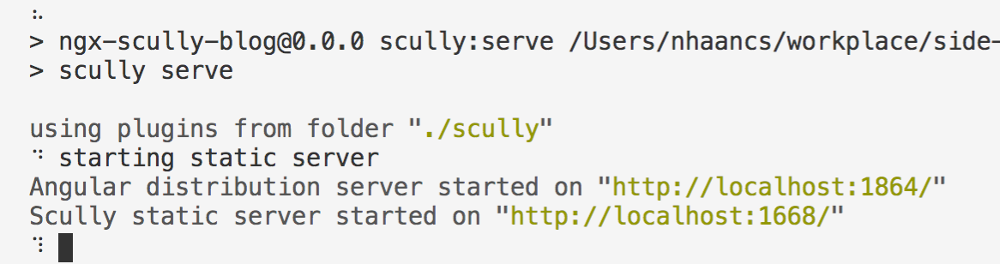
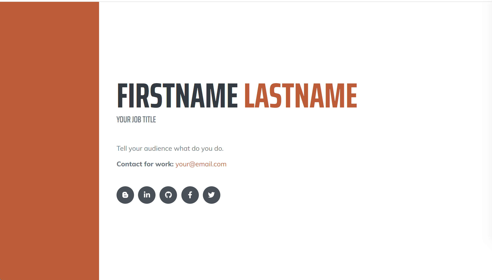
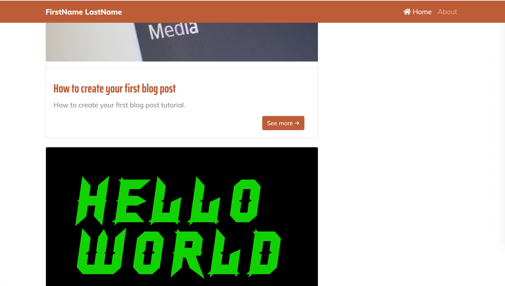
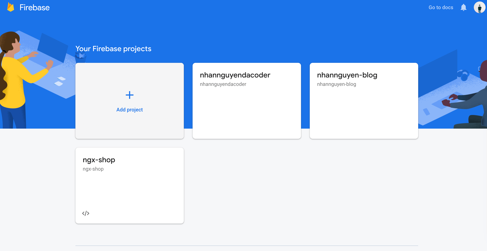
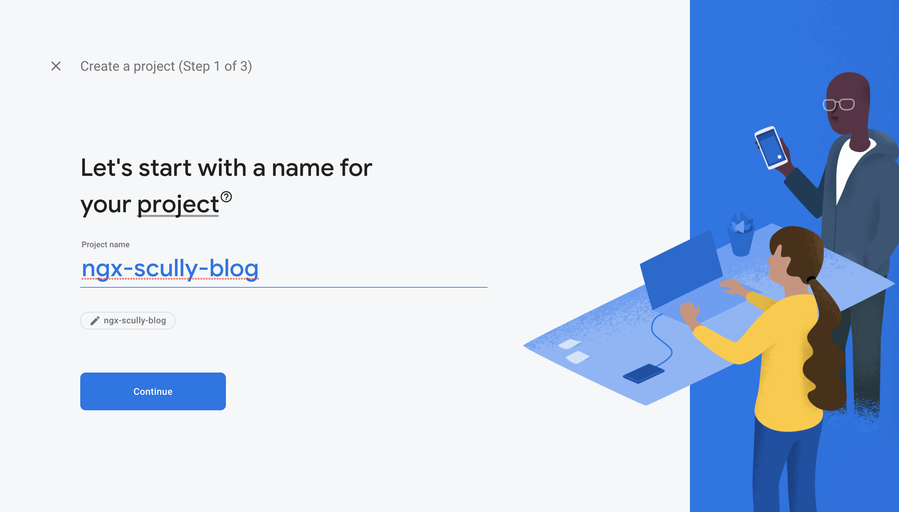
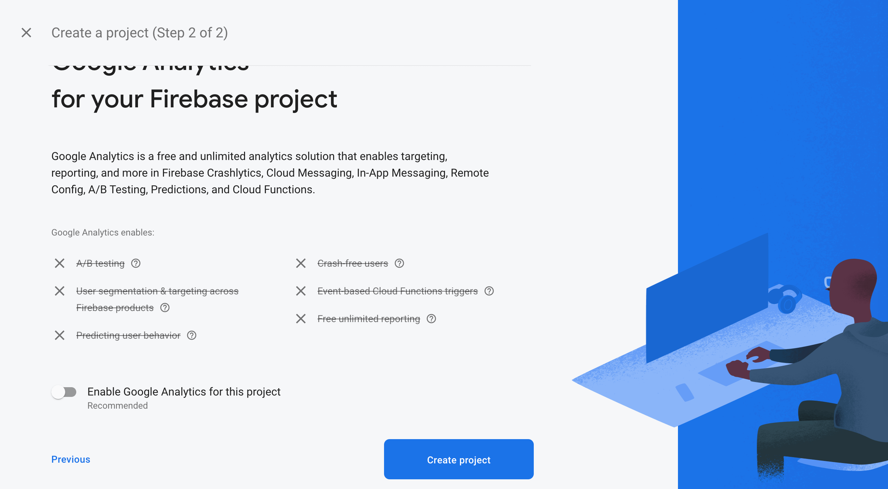
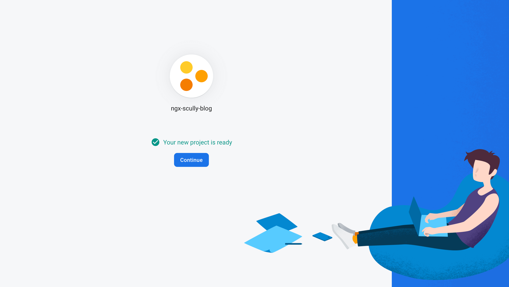

# Ngx-scully-blog: A simple blog for developers

TODO: check new post co tao route tu dong hay ko

You want to create a blog to share your knowledge or push you career, but you just want to focus on writing great articles and don't care about other stuff like search engine optimization, hosting, domain, beautiful UI, etc. This project can help you.

**Ngx-scully-blog** is a simple blog for developers that is easy to setup and SEO supported. After the inital setups, you only need to focus on writing your blog posts on markdown files.

This project is written in Angular, but you don't need to know anything about Angular. I'll guide you step by step. If you are an Angular developer already, this project is also a good choice as you can take advantages of your previous experience.

[Live demo](https://ngx-scully-blog.web.app)

## Table of contents
- [Prerequisites](#prerequisites)
- [Getting started](#getting-started)
    - [Checkout the project](#checkout-the-project)
    - [Setup Firebase to host your blog](#setup-firebase-to-host-your-blog)
    - [Personalize your blog](#personalize-your-blog)
    - [Deploy your app to Firebase](#deploy-your-app-to-firebase)
- [Write your first blog post](#write-your-first-blog-post)
- [Useful tips](#useful-tips)
- [Advanced usage](#advanced-usage)
- [Still have questions?](#still-have-questions)
- [Altenatives](#altenatives)
- [References](#references)

## Prerequisites
You need to know Mardown in order to write your blog posts. It is quite simple, and you can take a quick look about its syntax [here](https://guides.github.com/pdfs/markdown-cheatsheet-online.pdf).

## Getting started

### Checkout the project
Open your terminal and run the following commands in sequence:
- `git clone https://github.com/nhaancs/ngx-scully-blog.git`
- `cd ngx-scully-blog`
- `npm install`
- `npm run scully:preview`

This is the result when the last command done:



Go to Scully static server at [http://localhost:1668](http://localhost:1668). You will look something like this:



**Note**: You will see some ugly texts like "FIRSTNAME LASTNAME", "YOUR JOB TITLE", etc. Don't worry, we will fix these text with your personal information later.

Click on blog icon to go to blog home page at [http://localhost:1668/blog](http://localhost:1668/blog). You will look something like this:



Congrats, you have seen how your blog look like. Now you can stop your terminal and go to the next step to setup firebase for your blog to go live!

### Setup Firebase to host your blog
- Go to [https://console.firebase.google.com](https://console.firebase.google.com) and login as your google account.

- After login, click on **Add project** button to create a new project.
    

- Input your project name and click **Continue**. 
    

    **Note**: if your project name is `ngx-scully-blog`, your website address will be `ngx-scully-blog.web.app`. You can buy a custom domain like `yourdomain.com` and add to your project later. 
- Disable option **Enable Google analytics for this project** and click **Create project**
    
    
    *If you already have a Google anlytics acount, you can leave this option on*

- When your project is created, click **Continue** to go to the project home page.
    

Ok, we have setup Firebase. Now we will go back to the source code to personalize your blog, make it ready to be deployed on Firebase.

### Personalize your blog
- Open the source code you cloned on the first step on [vscode](https://code.visualstudio.com/) (you could use your editor as well)
- Open [`ngx-scully-blog/configuration/site-configs.ts`](./configuration/site-configs.ts) file. This is the place you can personalize the site's configurations and the contents displayed on your website (includes the portfolio page and the blog).
- Now lets customize all the configurations in [`site-configs.ts`](./configuration/site-configs.ts) file to make the website your own. I have put useful comments for each configuration so you can read the comments if you need more infomation.
- The final configuration your need to setup is for the sitemap plugin, which generate the `sitemap.xml` file for your website.
    - Open [`ngx-scully-blog/scully.ngx-scully-blog.config.ts`](./scully.ngx-scully-blog.config.ts)
    - Update `urlPrefix` to your domain. Normally, this url is: your-firebase-project-name.web.app

All the configurations have been setup and you are good to go. Lets deploy your blog to Firebase!


### Deploy your app to Firebase

Congrats, your blog now go live, everybody can see it.


## Write your first blog post
- 

## Useful tips
tiny url
facebook debug sharing

npm run scully -- --scanRoutes
npm run scully:preview
npm run scully:deploy

### Blog post formats

Your blog posts will be written in markdown format and stored in `/blog` folder.

Sample post: 

```
---
title: <the title of your post>
description: <the short description of your post>
published: <true or false, indicate whether or not show your post>
keywords: <the keywords of your post, separate with commas>
image: <a link to the thumbnail image of your post>
categories: <the categories that your post belong, separate with commas>
date: <YYYY-MM-DD>
---

<The content of your post written in markdown>

```

File name of a blog post:

`<category names> + <post title>.md`

## Advanced usage
You can read more advanced usage [here](./ADVANCED-USAGE.md)

## Still have questions?
For any futher questions, just creat a new issue. Thank you.

## Altenatives

## References
This project uses resources from:
- [Angular](https://angular.io)
- [Scully.io](https://scully.io)
- [Getting started with Scully](https://nartc-scully.netlify.app/blog/getting-started-scully)
- [Introducing Scully: Angular + JAMStack](https://www.youtube.com/watch?v=Sh37rIUL-d4)
- [Start Bootstrap Resume theme](https://startbootstrap.com/themes/resume)
- [Start Bootstrap Blog Home template](https://startbootstrap.com/templates/blog-home)
- [Start Bootstrap Blog Post template](http://startbootstrap.com/templates/blog-post)